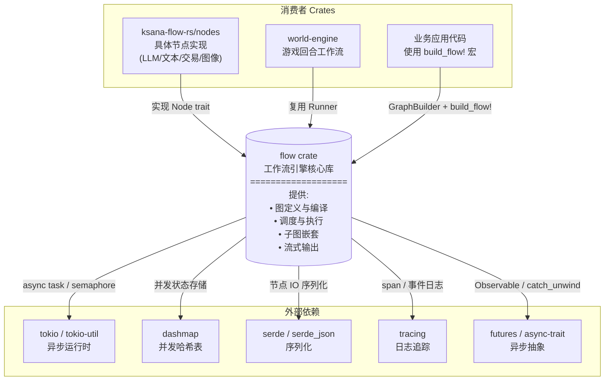
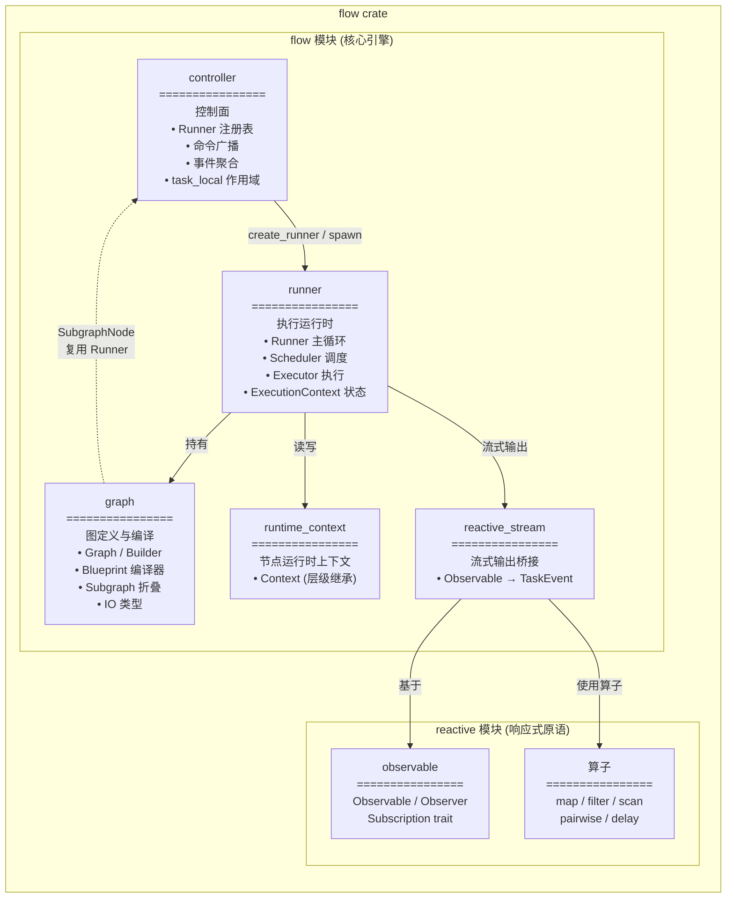
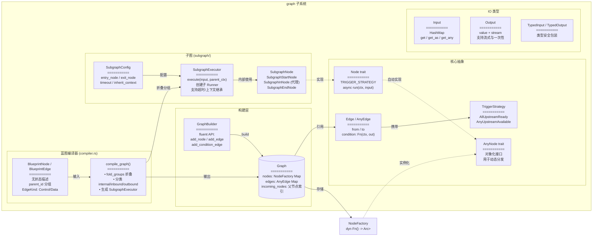
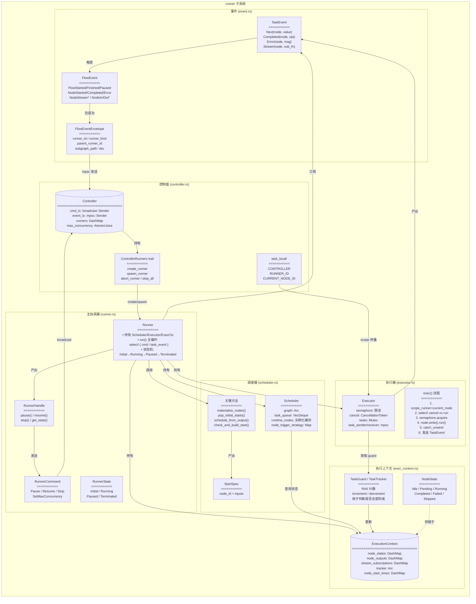
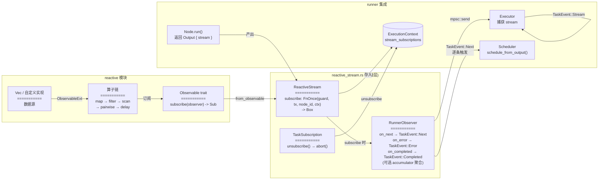
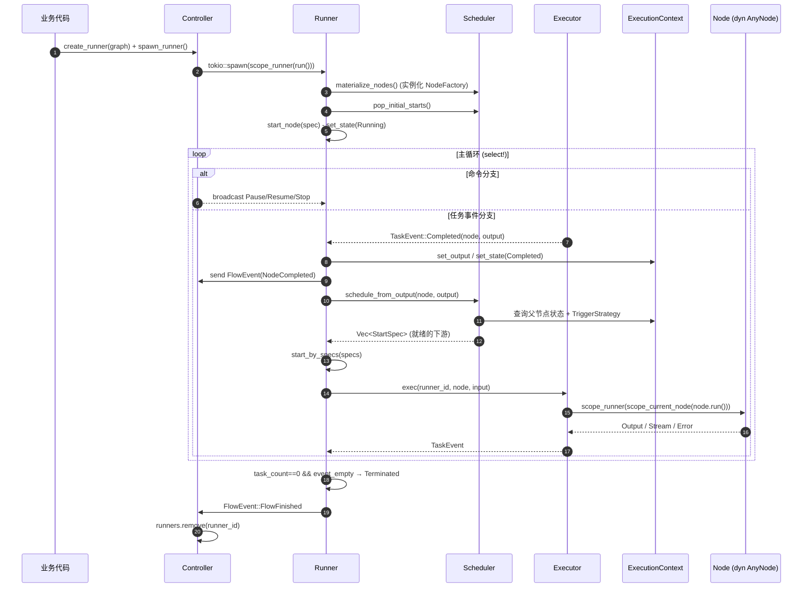

# flow 架构文档(C4 Model)

> 本文档基于 [C4 Model](https://c4model.com/) 描述 `ksana-flow-rs/flow` crate 的架构,分为 System Context、Container、Component 三个层级,并附运行时调用链与关键设计要点。

---

## Level 1 - System Context(系统上下文)

`flow` 是一个工作流引擎库,为业务代码提供 DAG 图定义、调度执行、子图嵌套与流式输出能力。



### 角色说明

| 角色 | 类型 | 职责 |
|------|------|------|
| `ksana-flow-rs/nodes` | 消费者 | 实现 `Node` trait,提供 LLM/文本/交易/图像等具体节点 |
| `world-engine` | 消费者 | 复用 Runner 实现游戏回合工作流 |
| 业务应用代码 | 消费者 | 通过 `GraphBuilder` 或 `build_flow!` 宏定义图并执行 |
| tokio | 依赖 | 提供 async task / semaphore / mpsc / broadcast |
| dashmap | 依赖 | 提供 ExecutionContext 等并发状态存储 |
| serde / serde_json | 依赖 | 节点 IO 的序列化 |
| tracing | 依赖 | span 与事件日志 |
| futures / async-trait | 依赖 | Observable 抽象与 catch_unwind |

---

## Level 2 - Container(容器视图)

`flow` 内部由两大子系统组成:`flow`(工作流引擎)与 `reactive`(响应式原语)。



### 模块职责

| 模块 | 路径 | 职责 |
|------|------|------|
| controller | `src/flow/controller.rs` | 控制面:Runner 注册表、命令广播、事件聚合、task_local 作用域 |
| runner | `src/flow/runner/` | 执行运行时:Runner 主循环、Scheduler、Executor、ExecutionContext |
| graph | `src/flow/graph/` | 图定义与编译:Graph/Builder、Blueprint 编译器、Subgraph 折叠、IO 类型 |
| runtime_context | `src/flow/runtime_context.rs` | 节点运行时上下文(支持层级继承) |
| reactive_stream | `src/flow/reactive_stream.rs` | 流式输出桥接:Observable → TaskEvent |
| reactive | `src/reactive/` | 响应式原语:Observable/Observer、map/filter/scan/pairwise/delay |

---

## Level 3 - Component(组件视图)

由于组件较多,按职责分为四张图。

### 3.1 图定义与编译子系统



#### 关键类型速查

| 类型 | 定义位置 | 说明 |
|------|----------|------|
| `Node` trait | `graph/graph.rs` | 节点核心 trait,带 `TRIGGER_STRATEGY` 常量 |
| `AnyNode` trait | `graph/graph.rs` | 对象化接口,用于动态分发 |
| `Edge` / `AnyEdge` | `graph/graph.rs` | 边定义,可携带 condition 闭包 |
| `TriggerStrategy` | `graph/graph.rs` | `AllUpstreamReady`(默认) / `AnyUpstreamAvailable` |
| `Graph` | `graph/graph.rs` | `nodes` + `edges` + `incoming_nodes` |
| `GraphBuilder` | `graph/builder.rs` | fluent 构建 API |
| `Input` / `Output` | `graph/io.rs` | 节点输入输出,Output 支持流式 |
| `BlueprintNode` / `BlueprintEdge` | `graph/compiler.rs` | 无状态蓝图描述 |
| `SubgraphExecutor` | `graph/subgraph/executor.rs` | 子图执行器,复用 Runner |
| `SubgraphConfig` | `graph/subgraph/executor.rs` | 子图配置(入口/出口/超时/继承上下文) |
| `SubgraphNode` 等 | `graph/subgraph/node.rs` | 子图容器节点与入/出/代理节点 |

#### 编译流程要点

1. **蓝图到运行时图**:`compile_graph()` 接收 `BlueprintNode` + `BlueprintEdge`,输出 `Arc<Graph>` 与起始节点列表。
2. **子图折叠**:`fold_groups()` 按 `parent_id` 分组,深度优先编译最深层子图,再逐层向外折叠。跨边被改写为连接到容器节点。
3. **边分类**:相对子图成员集合分为 `internal` / `inbound` / `outbound` 三类,跨边由代理节点 `SubgraphInNode` 转接。
4. **入出口节点**:子图自动创建 `__subgraph_start__{group_id}` 与 `__subgraph_end__{group_id}`,无入边的成员节点由 start 直接触发。

### 3.2 运行时执行子系统



#### 组件职责对照表

| 组件 | 文件 | 职责 |
|------|------|------|
| `Controller` | `controller.rs` | 控制面,持有命令通道、事件通道、Runner 注册表 |
| `ControllerRunners` trait | `controller.rs` | Runner 生命周期管理(create/spawn/abort/unregister/stop_all) |
| `Runner` | `runner/runner.rs` | 主协调器,select! 循环处理命令与任务事件 |
| `RunnerHandle` | `runner/runner.rs` | 对外句柄,可 pause/resume/stop/get_state |
| `Scheduler` | `runner/scheduler.rs` | 节点调度,基于 TriggerStrategy 与父节点状态判断就绪 |
| `Executor` | `runner/executor.rs` | 异步执行节点,管理 JoinSet/Semaphore/CancellationToken |
| `ExecutionContext` | `runner/exec_context.rs` | 并发存储节点状态/输出/流订阅/任务计数 |
| `TaskGuard` / `TaskTracker` | `runner/task_guard.rs` | RAII 任务计数,用于判断工作流是否全部完成 |
| `TaskEvent` | `runner/event.rs` | Executor → Runner 的内部事件 |
| `FlowEvent` / `FlowEventEnvelope` | `runner/event.rs` | Runner → 外部的事件,带 runner_id 与 subgraph_path |

#### Runner 状态机

```
Initial ──run()──► Running ──Pause──► Paused ──Resume──► Running
                       │                                  │
                       └──Stop/完成/错误──► Terminated ◄──┘
```

#### 主循环伪代码

```text
Runner::run():
  materialize_nodes()           # 实例化所有 NodeFactory
  pop_initial_starts()          # 取出初始节点
  start_by_specs(starts)        # 启动初始节点
  send FlowStarted

  loop:
    current_state = state_rx.borrow()
    select!:
      cmd = cmd_rx.recv():
        Pause → state=Paused, send FlowPaused
        Resume → state=Running, send FlowResumed
        Stop → executor.cancel(), state=Terminated, send FlowStopped, break
        SetMaxConcurrency(n) → executor.set_max_concurrency(n)

      event = executor.get_task_event() if state==Running:
        Stream(node, sub) → 订阅流,send NodeStreamStarted
        Next(node, out) → set_output, send NodeStreamNext, schedule_from_output
        Completed(node, out) → set_output, set_state(Completed), schedule_from_output
        Error(node, e) → set_state(Failed), send NodeError

    executor.reap_finished()
    if task_count==0 && event_empty && state==Running:
      state=Terminated, send FlowFinished, break
```

### 3.3 子图执行流(嵌套 Runner)

```mermaid
flowchart TB
    ParentRunner["父图 Runner<br/>(Root Runner)"]
    SubgraphNode["SubgraphNode.run()<br/>===========<br/>pack_inputs_to_object(input)"]
    SubExecutor["SubgraphExecutor.execute()<br/>===========<br/>1. create_context (隔离/继承)<br/>2. controller.create_runner()<br/>3. runner.set_start_node(entry)<br/>4. scope_runner(runner.run())<br/>5. 等待完成/超时<br/>6. 取 exit_node 输出"]
    ChildRunner["子图 Runner<br/>(Subgraph Runner)"]
    Controller[("Controller<br/>runners registry")]

    ParentRunner -->|执行节点| SubgraphNode
    SubgraphNode -->|调用| SubExecutor
    SubExecutor -->|"create_runner<br/>(RunnerKind::Subgraph,<br/>parent_runner_id, parent_node_id)"| Controller
    Controller -->|注册并返回| ChildRunner
    SubExecutor -->|set_runtime_context| ChildRunner
    SubExecutor -->|set_start_node| ChildRunner
    SubExecutor -->|await run()| ChildRunner
    ChildRunner -->|"run() 内部:<br/>scope_runner(CONTROLLER,<br/>RUNNER_ID, run())"| ChildRunner
    ChildRunner -->|FlowEvent| Controller
    Controller -->|带 parent_runner_id 的<br/>FlowEventEnvelope| ParentRunner
```

#### 子图执行要点

1. **复用 Runner**:`SubgraphExecutor` 通过 `Controller::create_runner()` 创建子 Runner,与父 Runner 共享同一 `Controller`。
2. **上下文隔离/继承**:`SubgraphConfig.inherit_context` 控制是否继承父 Context;隔离时使用全新 Context。
3. **超时控制**:可选 `timeout`,通过 `tokio::time::timeout` 包装 `runner.run()`。
4. **结果获取**:从 `exit_node` 的输出中取出子图结果。
5. **事件溯源**:子 Runner 的 `FlowEvent` 经 `Controller` 包装为 `FlowEventEnvelope`,带 `parent_runner_id` 与 `subgraph_path: Vec<SubgraphFrame>`,外部可还原嵌套调用链。
6. **task_local 传播**:`scope_runner()` 在子 Runner 内重新注入 `CONTROLLER` 与 `RUNNER_ID`,使节点代码在任何嵌套深度都能通过 `try_controller()` / `try_runner_id()` 拿回当前上下文。

### 3.4 响应式流式输出子系统



#### 流式输出要点

1. **Observable 桥接**:`ReactiveStream::from_observable()` 把任意 `Observable` 包装为 `subscribe` 闭包,在 Runner 启动流时被调用。
2. **背压**:RunnerObserver 通过异步 `mpsc::send` 发送 `TaskEvent::Next`,通道满时自动挂起,实现天然背压。
3. **逐条调度**:每个 `TaskEvent::Next` 都会触发 `Scheduler::schedule_from_output()`,使下游节点能基于流式数据即时触发。
4. **聚合**:`from_observable_with_accumulator()` 支持在 `on_completed` 时把累积的 buffer 聚合为最终输出。
5. **订阅管理**:`TaskSubscription` 持有 `JoinHandle`,`unsubscribe()` 调用 `abort()`;订阅存储在 `ExecutionContext.stream_subscriptions` 中,节点完成/出错时移除。

---

## 关键执行流(动态视角)

补充一张运行时调用链,帮助理解组件如何协作。



---

## 架构要点小结

| 层级 | 关注点 | 核心组件 |
|------|--------|----------|
| **L1 Context** | flow 作为库与外部交互 | 业务 crate → flow → tokio/dashmap/serde |
| **L2 Container** | 两大子系统职责划分 | `flow`(引擎核心) + `reactive`(响应式原语) |
| **L3 Component** | 组件协作与数据流 | Controller(控制面) ↔ Runner(协调器) ↔ Scheduler(调度) + Executor(执行) + ExecutionContext(状态) |
| **子图嵌套** | 复用 Runner 实现层级执行 | SubgraphNode → SubgraphExecutor → Controller.create_runner → 子 Runner |
| **流式输出** | Observable 桥接到 TaskEvent | Node 产出 ReactiveStream → RunnerObserver → mpsc → Runner 调度下游 |

### 设计亮点

1. **控制面与执行面分离** - `Controller` 用 `broadcast` 发命令、`mpsc` 收事件,Runner 之间通过 `Controller` 注册表实现父子关系,子图复用同一套 Runner 机制。
2. **task_local 作用域传播** - `CONTROLLER` / `RUNNER_ID` / `CURRENT_NODE_ID` 通过 `scope_runner` / `scope_current_node` 注入,节点代码可在任何嵌套深度通过 `try_controller()` 等拿回当前上下文,无需显式传参。
3. **NodeFactory 状态隔离** - 每次执行生成全新的节点实例(`Arc<RwLock<dyn AnyNode>>`),保证同图多次运行的状态隔离。
4. **catch_unwind 容错** - Executor 对 `node.run()` 包裹 `AssertUnwindSafe + catch_unwind`,节点 panic 不会击穿 Runner,而是转为 `TaskEvent::Error`。
5. **流式与一次性统一** - `Output` 同时承载 `value` 与 `stream`,Runner 根据是否流式走不同的处理路径,下游调度对两者统一。
